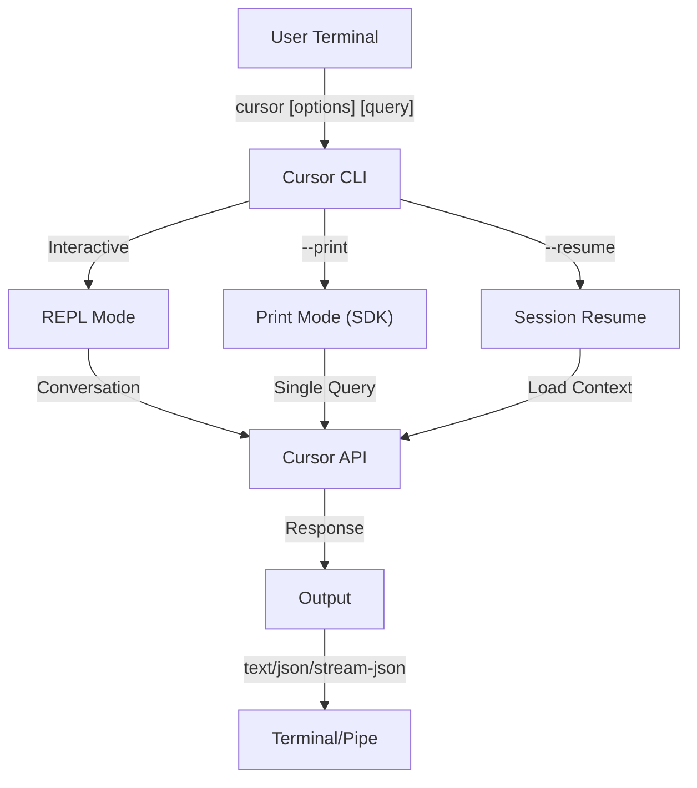
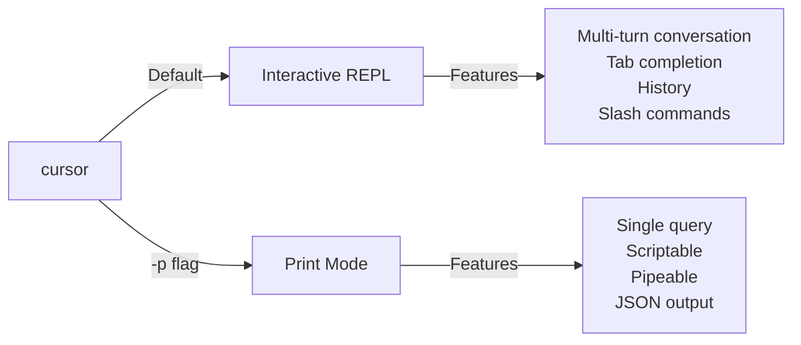

<picture>
  <source media="(prefers-color-scheme: dark)" srcset="../resources/logos/cursor-howto-logo-dark.svg">
  
</picture>

# CLI Reference

## Overview

The Cursor CLI (Command Line Interface) is the primary way to interact with Cursor. It provides powerful options for running queries, managing sessions, configuring models, and integrating Cursor into your development workflows.

## Architecture



## CLI Commands

| Command | Description | Example |
|---------|-------------|---------|
| `cursor` | Start interactive REPL | `cursor` |
| `cursor "query"` | Start REPL with initial prompt | `cursor "explain this project"` |
| `cursor -p "query"` | Print mode - query then exit | `cursor -p "explain this function"` |
| `cat file \| cursor -p "query"` | Process piped content | `cat logs.txt \| cursor -p "explain"` |
| `cursor -c` | Continue most recent conversation | `cursor -c` |
| `cursor -c -p "query"` | Continue in print mode | `cursor -c -p "check for type errors"` |
| `cursor -r "<session>" "query"` | Resume session by ID or name | `cursor -r "auth-refactor" "finish this PR"` |
| `cursor update` | Update to latest version | `cursor update` |
| `cursor mcp` | Configure MCP servers | See [MCP documentation](../05-mcp/) |
| `cursor mcp serve` | Run Cursor as an MCP server | `cursor mcp serve` |
| `cursor agents` | List all configured subagents | `cursor agents` |
| `cursor auto-mode defaults` | Print auto mode default rules as JSON | `cursor auto-mode defaults` |
| `cursor remote-control` | Start Remote Control server | `cursor remote-control` |
| `cursor plugin` | Manage plugins (install, enable, disable) | `cursor plugin install my-plugin` |
| `cursor auth login` | Log in (supports `--email`, `--sso`) | `cursor auth login --email user@example.com` |
| `cursor auth logout` | Log out of current account | `cursor auth logout` |
| `cursor auth status` | Check auth status (exit 0 if logged in, 1 if not) | `cursor auth status` |

## Core Flags

| Flag | Description | Example |
|------|-------------|---------|
| `-p, --print` | Print response without interactive mode | `cursor -p "query"` |
| `-c, --continue` | Load most recent conversation | `cursor --continue` |
| `-r, --resume` | Resume specific session by ID or name | `cursor --resume auth-refactor` |
| `-v, --version` | Output version number | `cursor -v` |
| `-w, --worktree` | Start in isolated git worktree | `cursor -w` |
| `-n, --name` | Session display name | `cursor -n "auth-refactor"` |
| `--from-pr <number>` | Resume sessions linked to GitHub PR | `cursor --from-pr 42` |
| `--remote "task"` | Create web session on cursor.com | `cursor --remote "implement API"` |
| `--remote-control, --rc` | Interactive session with Remote Control | `cursor --rc` |
| `--teleport` | Resume web session locally | `cursor --teleport` |
| `--teammate-mode` | Agent team display mode | `cursor --teammate-mode tmux` |
| `--bare` | Minimal mode (skip hooks, skills, plugins, MCP, auto memory, CURSOR.md) | `cursor --bare` |
| `--enable-auto-mode` | Unlock auto permission mode | `cursor --enable-auto-mode` |
| `--channels` | Subscribe to MCP channel plugins | `cursor --channels discord,telegram` |
| `--chrome` / `--no-chrome` | Enable/disable Chrome browser integration | `cursor --chrome` |
| `--effort` | Set thinking effort level | `cursor --effort high` |
| `--init` / `--init-only` | Run initialization hooks | `cursor --init` |
| `--maintenance` | Run maintenance hooks and exit | `cursor --maintenance` |
| `--disable-slash-commands` | Disable all skills and slash commands | `cursor --disable-slash-commands` |
| `--no-session-persistence` | Disable session saving (print mode) | `cursor -p --no-session-persistence "query"` |

### Interactive vs Print Mode



**Interactive Mode** (default):
```bash
# Start interactive session
cursor

# Start with initial prompt
cursor "explain the authentication flow"
```

**Print Mode** (non-interactive):
```bash
# Single query, then exit
cursor -p "what does this function do?"

# Process file content
cat error.log | cursor -p "explain this error"

# Chain with other tools
cursor -p "list todos" | grep "URGENT"
```

## Model & Configuration

| Flag | Description | Example |
|------|-------------|---------|
| `--model` | Set model (sonnet, opus, haiku, or full name) | `cursor --model opus` |
| `--fallback-model` | Automatic model fallback when overloaded | `cursor -p --fallback-model sonnet "query"` |
| `--agent` | Specify agent for session | `cursor --agent my-custom-agent` |
| `--agents` | Define custom subagents via JSON | See [Agents Configuration](#agents-configuration) |
| `--effort` | Set effort level (low, medium, high, max) | `cursor --effort high` |

### Model Selection Examples

```bash
# Use Opus 4.6 for complex tasks
cursor --model opus "design a caching strategy"

# Use Haiku 4.5 for quick tasks
cursor --model haiku -p "format this JSON"

# Full model name
cursor --model cursor-sonnet-4-6-20250929 "review this code"

# With fallback for reliability
cursor -p --model opus --fallback-model sonnet "analyze architecture"

# Use opusplan (Opus plans, Sonnet executes)
cursor --model opusplan "design and implement the caching layer"
```

## System Prompt Customization

| Flag | Description | Example |
|------|-------------|---------|
| `--system-prompt` | Replace entire default prompt | `cursor --system-prompt "You are a Python expert"` |
| `--system-prompt-file` | Load prompt from file (print mode) | `cursor -p --system-prompt-file ./prompt.txt "query"` |
| `--append-system-prompt` | Append to default prompt | `cursor --append-system-prompt "Always use TypeScript"` |

### System Prompt Examples

```bash
# Complete custom persona
cursor --system-prompt "You are a senior security engineer. Focus on vulnerabilities."

# Append specific instructions
cursor --append-system-prompt "Always include unit tests with code examples"

# Load complex prompt from file
cursor -p --system-prompt-file ./prompts/code-reviewer.txt "review main.py"
```

### System Prompt Flags Comparison

| Flag | Behavior | Interactive | Print |
|------|----------|-------------|-------|
| `--system-prompt` | Replaces entire default system prompt | ✅ | ✅ |
| `--system-prompt-file` | Replaces with prompt from file | ❌ | ✅ |
| `--append-system-prompt` | Appends to default system prompt | ✅ | ✅ |

**Use `--system-prompt-file` only in print mode. For interactive mode, use `--system-prompt` or `--append-system-prompt`.**

## Tool & Permission Management

| Flag | Description | Example |
|------|-------------|---------|
| `--tools` | Restrict available built-in tools | `cursor -p --tools "Bash,Edit,Read" "query"` |
| `--allowedTools` | Tools that execute without prompting | `"Bash(git log:*)" "Read"` |
| `--disallowedTools` | Tools removed from context | `"Bash(rm:*)" "Edit"` |
| `--dangerously-skip-permissions` | Skip all permission prompts | `cursor --dangerously-skip-permissions` |
| `--permission-mode` | Begin in specified permission mode | `cursor --permission-mode auto` |
| `--permission-prompt-tool` | MCP tool for permission handling | `cursor -p --permission-prompt-tool mcp_auth "query"` |
| `--enable-auto-mode` | Unlock auto permission mode | `cursor --enable-auto-mode` |

### Permission Examples

```bash
# Read-only mode for code review
cursor --permission-mode plan "review this codebase"

# Restrict to safe tools only
cursor --tools "Read,Grep,Glob" -p "find all TODO comments"

# Allow specific git commands without prompts
cursor --allowedTools "Bash(git status:*)" "Bash(git log:*)"

# Block dangerous operations
cursor --disallowedTools "Bash(rm -rf:*)" "Bash(git push --force:*)"
```

## Output & Format

| Flag | Description | Options | Example |
|------|-------------|---------|---------|
| `--output-format` | Specify output format (print mode) | `text`, `json`, `stream-json` | `cursor -p --output-format json "query"` |
| `--input-format` | Specify input format (print mode) | `text`, `stream-json` | `cursor -p --input-format stream-json` |
| `--verbose` | Enable verbose logging | | `cursor --verbose` |
| `--include-partial-messages` | Include streaming events | Requires `stream-json` | `cursor -p --output-format stream-json --include-partial-messages "query"` |
| `--json-schema` | Get validated JSON matching schema | | `cursor -p --json-schema '{"type":"object"}' "query"` |
| `--max-budget-usd` | Maximum spend for print mode | | `cursor -p --max-budget-usd 5.00 "query"` |

### Output Format Examples

```bash
# Plain text (default)
cursor -p "explain this code"

# JSON for programmatic use
cursor -p --output-format json "list all functions in main.py"

# Streaming JSON for real-time processing
cursor -p --output-format stream-json "generate a long report"

# Structured output with schema validation
cursor -p --json-schema '{"type":"object","properties":{"bugs":{"type":"array"}}}' \
  "find bugs in this code and return as JSON"
```

## Workspace & Directory

| Flag | Description | Example |
|------|-------------|---------|
| `--add-dir` | Add additional working directories | `cursor --add-dir ../apps ../lib` |
| `--setting-sources` | Comma-separated setting sources | `cursor --setting-sources user,project` |
| `--settings` | Load settings from file or JSON | `cursor --settings ./settings.json` |
| `--plugin-dir` | Load plugins from directory (repeatable) | `cursor --plugin-dir ./my-plugin` |

### Multi-Directory Example

```bash
# Work across multiple project directories
cursor --add-dir ../frontend ../backend ../shared "find all API endpoints"

# Load custom settings
cursor --settings '{"model":"opus","verbose":true}' "complex task"
```

## MCP Configuration

| Flag | Description | Example |
|------|-------------|---------|
| `--mcp-config` | Load MCP servers from JSON | `cursor --mcp-config ./mcp.json` |
| `--strict-mcp-config` | Only use specified MCP config | `cursor --strict-mcp-config --mcp-config ./mcp.json` |
| `--channels` | Subscribe to MCP channel plugins | `cursor --channels discord,telegram` |

### MCP Examples

```bash
# Load GitHub MCP server
cursor --mcp-config ./github-mcp.json "list open PRs"

# Strict mode - only specified servers
cursor --strict-mcp-config --mcp-config ./production-mcp.json "deploy to staging"
```

## Session Management

| Flag | Description | Example |
|------|-------------|---------|
| `--session-id` | Use specific session ID (UUID) | `cursor --session-id "550e8400-..."` |
| `--fork-session` | Create new session when resuming | `cursor --resume abc123 --fork-session` |

### Session Examples

```bash
# Continue last conversation
cursor -c

# Resume named session
cursor -r "feature-auth" "continue implementing login"

# Fork session for experimentation
cursor --resume feature-auth --fork-session "try alternative approach"

# Use specific session ID
cursor --session-id "550e8400-e29b-41d4-a716-446655440000" "continue"
```

### Session Fork

Create a branch from an existing session for experimentation:

```bash
# Fork a session to try a different approach
cursor --resume abc123 --fork-session "try alternative implementation"

# Fork with a custom message
cursor -r "feature-auth" --fork-session "test with different architecture"
```

**Use Cases:**
- Try alternative implementations without losing the original session
- Experiment with different approaches in parallel
- Create branches from successful work for variations
- Test breaking changes without affecting the main session

The original session remains unchanged, and the fork becomes a new independent session.

## Advanced Features

| Flag | Description | Example |
|------|-------------|---------|
| `--chrome` | Enable Chrome browser integration | `cursor --chrome` |
| `--no-chrome` | Disable Chrome browser integration | `cursor --no-chrome` |
| `--ide` | Auto-connect to IDE if available | `cursor --ide` |
| `--max-turns` | Limit agentic turns (non-interactive) | `cursor -p --max-turns 3 "query"` |
| `--debug` | Enable debug mode with filtering | `cursor --debug "api,mcp"` |
| `--enable-lsp-logging` | Enable verbose LSP logging | `cursor --enable-lsp-logging` |
| `--betas` | Beta headers for API requests | `cursor --betas interleaved-thinking` |
| `--plugin-dir` | Load plugins from directory (repeatable) | `cursor --plugin-dir ./my-plugin` |
| `--enable-auto-mode` | Unlock auto permission mode | `cursor --enable-auto-mode` |
| `--effort` | Set thinking effort level | `cursor --effort high` |
| `--bare` | Minimal mode (skip hooks, skills, plugins, MCP, auto memory, CURSOR.md) | `cursor --bare` |
| `--channels` | Subscribe to MCP channel plugins | `cursor --channels discord` |
| `--fork-session` | Create new session ID when resuming | `cursor --resume abc --fork-session` |
| `--max-budget-usd` | Maximum spend (print mode) | `cursor -p --max-budget-usd 5.00 "query"` |
| `--json-schema` | Validated JSON output | `cursor -p --json-schema '{"type":"object"}' "q"` |

### Advanced Examples

```bash
# Limit autonomous actions
cursor -p --max-turns 5 "refactor this module"

# Debug API calls
cursor --debug "api" "test query"

# Enable IDE integration
cursor --ide "help me with this file"
```

## Agents Configuration

The `--agents` flag accepts a JSON object defining custom subagents for a session.

### Agents JSON Format

```json
{
  "agent-name": {
    "description": "Required: when to invoke this agent",
    "prompt": "Required: system prompt for the agent",
    "tools": ["Optional", "array", "of", "tools"],
    "model": "optional: sonnet|opus|haiku"
  }
}
```

**Required Fields:**
- `description` - Natural language description of when to use this agent
- `prompt` - System prompt that defines the agent's role and behavior

**Optional Fields:**
- `tools` - Array of available tools (inherits all if omitted)
  - Format: `["Read", "Grep", "Glob", "Bash"]`
- `model` - Model to use: `sonnet`, `opus`, or `haiku`

### Complete Agents Example

```json
{
  "code-reviewer": {
    "description": "Expert code reviewer. Use proactively after code changes.",
    "prompt": "You are a senior code reviewer. Focus on code quality, security, and best practices.",
    "tools": ["Read", "Grep", "Glob", "Bash"],
    "model": "sonnet"
  },
  "debugger": {
    "description": "Debugging specialist for errors and test failures.",
    "prompt": "You are an expert debugger. Analyze errors, identify root causes, and provide fixes.",
    "tools": ["Read", "Edit", "Bash", "Grep"],
    "model": "opus"
  },
  "documenter": {
    "description": "Documentation specialist for generating guides.",
    "prompt": "You are a technical writer. Create clear, comprehensive documentation.",
    "tools": ["Read", "Write"],
    "model": "haiku"
  }
}
```

### Agents Command Examples

```bash
# Define custom agents inline
cursor --agents '{
  "security-auditor": {
    "description": "Security specialist for vulnerability analysis",
    "prompt": "You are a security expert. Find vulnerabilities and suggest fixes.",
    "tools": ["Read", "Grep", "Glob"],
    "model": "opus"
  }
}' "audit this codebase for security issues"

# Load agents from file
cursor --agents "$(cat ~/.cursor/agents.json)" "review the auth module"

# Combine with other flags
cursor -p --agents "$(cat agents.json)" --model sonnet "analyze performance"
```

### Agent Priority

When multiple agent definitions exist, they are loaded in this priority order:
1. **CLI-defined** (`--agents` flag) - Session-specific
2. **User-level** (`~/.cursor/agents/`) - All projects
3. **Project-level** (`.cursor/agents/`) - Current project

CLI-defined agents override both user and project agents for the session.

---

## High-Value Use Cases

### 1. CI/CD Integration

Use Cursor in your CI/CD pipelines for automated code review, testing, and documentation.

**GitHub Actions Example:**

```yaml
name: AI Code Review

on: [pull_request]

jobs:
  review:
    runs-on: ubuntu-latest
    steps:
      - uses: actions/checkout@v4

      - name: Install Cursor
        run: echo "Install Cursor from https://cursor.com"

      - name: Run Code Review
        env:
          ANTHROPIC_API_KEY: ${{ secrets.ANTHROPIC_API_KEY }}
        run: |
          cursor -p --output-format json \
            --max-turns 1 \
            "Review the changes in this PR for:
            - Security vulnerabilities
            - Performance issues
            - Code quality
            Output as JSON with 'issues' array" > review.json

      - name: Post Review Comment
        uses: actions/github-script@v7
        with:
          script: |
            const fs = require('fs');
            const review = JSON.parse(fs.readFileSync('review.json', 'utf8'));
            // Process and post review comments
```

**Jenkins Pipeline:**

```groovy
pipeline {
    agent any
    stages {
        stage('AI Review') {
            steps {
                sh '''
                    cursor -p --output-format json \
                      --max-turns 3 \
                      "Analyze test coverage and suggest missing tests" \
                      > coverage-analysis.json
                '''
            }
        }
    }
}
```

### 2. Script Piping

Process files, logs, and data through Cursor for analysis.

**Log Analysis:**

```bash
# Analyze error logs
tail -1000 /var/log/app/error.log | cursor -p "summarize these errors and suggest fixes"

# Find patterns in access logs
cat access.log | cursor -p "identify suspicious access patterns"

# Analyze git history
git log --oneline -50 | cursor -p "summarize recent development activity"
```

**Code Processing:**

```bash
# Review a specific file
cat src/auth.ts | cursor -p "review this authentication code for security issues"

# Generate documentation
cat src/api/*.ts | cursor -p "generate API documentation in markdown"

# Find TODOs and prioritize
grep -r "TODO" src/ | cursor -p "prioritize these TODOs by importance"
```

### 3. Multi-Session Workflows

Manage complex projects with multiple conversation threads.

```bash
# Start a feature branch session
cursor -r "feature-auth" "let's implement user authentication"

# Later, continue the session
cursor -r "feature-auth" "add password reset functionality"

# Fork to try an alternative approach
cursor --resume feature-auth --fork-session "try OAuth instead"

# Switch between different feature sessions
cursor -r "feature-payments" "continue with Stripe integration"
```

### 4. Custom Agent Configuration

Define specialized agents for your team's workflows.

```bash
# Save agents config to file
cat > ~/.cursor/agents.json << 'EOF'
{
  "reviewer": {
    "description": "Code reviewer for PR reviews",
    "prompt": "Review code for quality, security, and maintainability.",
    "model": "opus"
  },
  "documenter": {
    "description": "Documentation specialist",
    "prompt": "Generate clear, comprehensive documentation.",
    "model": "sonnet"
  },
  "refactorer": {
    "description": "Code refactoring expert",
    "prompt": "Suggest and implement clean code refactoring.",
    "tools": ["Read", "Edit", "Glob"]
  }
}
EOF

# Use agents in session
cursor --agents "$(cat ~/.cursor/agents.json)" "review the auth module"
```

### 5. Batch Processing

Process multiple queries with consistent settings.

```bash
# Process multiple files
for file in src/*.ts; do
  echo "Processing $file..."
  cursor -p --model haiku "summarize this file: $(cat $file)" >> summaries.md
done

# Batch code review
find src -name "*.py" -exec sh -c '
  echo "## $1" >> review.md
  cat "$1" | cursor -p "brief code review" >> review.md
' _ {} \;

# Generate tests for all modules
for module in $(ls src/modules/); do
  cursor -p "generate unit tests for src/modules/$module" > "tests/$module.test.ts"
done
```

### 6. Security-Conscious Development

Use permission controls for safe operation.

```bash
# Read-only security audit
cursor --permission-mode plan \
  --tools "Read,Grep,Glob" \
  "audit this codebase for security vulnerabilities"

# Block dangerous commands
cursor --disallowedTools "Bash(rm:*)" "Bash(curl:*)" "Bash(wget:*)" \
  "help me clean up this project"

# Restricted automation
cursor -p --max-turns 2 \
  --allowedTools "Read" "Glob" \
  "find all hardcoded credentials"
```

### 7. JSON API Integration

Use Cursor as a programmable API for your tools with `jq` parsing.

```bash
# Get structured analysis
cursor -p --output-format json \
  --json-schema '{"type":"object","properties":{"functions":{"type":"array"},"complexity":{"type":"string"}}}' \
  "analyze main.py and return function list with complexity rating"

# Integrate with jq for processing
cursor -p --output-format json "list all API endpoints" | jq '.endpoints[]'

# Use in scripts
RESULT=$(cursor -p --output-format json "is this code secure? answer with {secure: boolean, issues: []}" < code.py)
if echo "$RESULT" | jq -e '.secure == false' > /dev/null; then
  echo "Security issues found!"
  echo "$RESULT" | jq '.issues[]'
fi
```

### jq Parsing Examples

Parse and process Cursor's JSON output using `jq`:

```bash
# Extract specific fields
cursor -p --output-format json "analyze this code" | jq '.result'

# Filter array elements
cursor -p --output-format json "list issues" | jq -r '.issues[] | select(.severity=="high")'

# Extract multiple fields
cursor -p --output-format json "describe the project" | jq -r '.{name, version, description}'

# Convert to CSV
cursor -p --output-format json "list functions" | jq -r '.functions[] | [.name, .lineCount] | @csv'

# Conditional processing
cursor -p --output-format json "check security" | jq 'if .vulnerabilities | length > 0 then "UNSAFE" else "SAFE" end'

# Extract nested values
cursor -p --output-format json "analyze performance" | jq '.metrics.cpu.usage'

# Process entire array
cursor -p --output-format json "find todos" | jq '.todos | length'

# Transform output
cursor -p --output-format json "list improvements" | jq 'map({title: .title, priority: .priority})'
```

---

## Models

Cursor supports multiple models with different capabilities:

| Model | ID | Context Window | Notes |
|-------|-----|----------------|-------|
| Opus 4.6 | `cursor-opus-4-6` | 1M tokens | Most capable, adaptive effort levels |
| Sonnet 4.6 | `cursor-sonnet-4-6` | 1M tokens | Balanced speed and capability |
| Haiku 4.5 | `cursor-haiku-4-5` | 1M tokens | Fastest, best for quick tasks |

### Model Selection

```bash
# Use short names
cursor --model opus "complex architectural review"
cursor --model sonnet "implement this feature"
cursor --model haiku -p "format this JSON"

# Use opusplan alias (Opus plans, Sonnet executes)
cursor --model opusplan "design and implement the API"

# Toggle fast mode during session
/fast
```

### Effort Levels (Opus 4.6)

Opus 4.6 supports adaptive reasoning with effort levels:

```bash
# Set effort level via CLI flag
cursor --effort high "complex review"

# Set effort level via slash command
/effort high

# Set effort level via environment variable
export CURSOR_EFFORT_LEVEL=high   # low, medium, high, or max (Opus 4.6 only)
```

The "ultrathink" keyword in prompts activates deep reasoning. The `max` effort level is exclusive to Opus 4.6.

---

## Key Environment Variables

| Variable | Description |
|----------|-------------|
| `ANTHROPIC_API_KEY` | API key for authentication |
| `ANTHROPIC_MODEL` | Override default model |
| `ANTHROPIC_CUSTOM_MODEL_OPTION` | Custom model option for API |
| `ANTHROPIC_DEFAULT_OPUS_MODEL` | Override default Opus model ID |
| `ANTHROPIC_DEFAULT_SONNET_MODEL` | Override default Sonnet model ID |
| `ANTHROPIC_DEFAULT_HAIKU_MODEL` | Override default Haiku model ID |
| `MAX_THINKING_TOKENS` | Set extended thinking token budget |
| `CURSOR_EFFORT_LEVEL` | Set effort level (`low`/`medium`/`high`/`max`) |
| `CURSOR_SIMPLE` | Minimal mode, set by `--bare` flag |
| `CURSOR_DISABLE_AUTO_MEMORY` | Disable automatic CURSOR.md updates |
| `CURSOR_DISABLE_BACKGROUND_TASKS` | Disable background task execution |
| `CURSOR_DISABLE_CRON` | Disable scheduled/cron tasks |
| `CURSOR_DISABLE_GIT_INSTRUCTIONS` | Disable git-related instructions |
| `CURSOR_DISABLE_TERMINAL_TITLE` | Disable terminal title updates |
| `CURSOR_DISABLE_1M_CONTEXT` | Disable 1M token context window |
| `CURSOR_DISABLE_NONSTREAMING_FALLBACK` | Disable non-streaming fallback |
| `CURSOR_ENABLE_TASKS` | Enable task list feature |
| `CURSOR_TASK_LIST_ID` | Named task directory shared across sessions |
| `CURSOR_ENABLE_PROMPT_SUGGESTION` | Toggle prompt suggestions (`true`/`false`) |
| `CURSOR_EXPERIMENTAL_AGENT_TEAMS` | Enable experimental agent teams |
| `CURSOR_NEW_INIT` | Use new initialization flow |
| `CURSOR_SUBAGENT_MODEL` | Model for subagent execution |
| `CURSOR_PLUGIN_SEED_DIR` | Directory for plugin seed files |
| `CURSOR_SUBPROCESS_ENV_SCRUB` | Env vars to scrub from subprocesses |
| `CURSOR_AUTOCOMPACT_PCT_OVERRIDE` | Override auto-compaction percentage |
| `CURSOR_STREAM_IDLE_TIMEOUT_MS` | Stream idle timeout in milliseconds |
| `SLASH_COMMAND_TOOL_CHAR_BUDGET` | Character budget for slash command tools |
| `ENABLE_TOOL_SEARCH` | Enable tool search capability |
| `MAX_MCP_OUTPUT_TOKENS` | Maximum tokens for MCP tool output |

---

## Quick Reference

### Most Common Commands

```bash
# Interactive session
cursor

# Quick question
cursor -p "how do I..."

# Continue conversation
cursor -c

# Process a file
cat file.py | cursor -p "review this"

# JSON output for scripts
cursor -p --output-format json "query"
```

### Flag Combinations

| Use Case | Command |
|----------|---------|
| Quick code review | `cat file | cursor -p "review"` |
| Structured output | `cursor -p --output-format json "query"` |
| Safe exploration | `cursor --permission-mode plan` |
| Autonomous with safety | `cursor --enable-auto-mode --permission-mode auto` |
| CI/CD integration | `cursor -p --max-turns 3 --output-format json` |
| Resume work | `cursor -r "session-name"` |
| Custom model | `cursor --model opus "complex task"` |
| Minimal mode | `cursor --bare "quick query"` |
| Budget-capped run | `cursor -p --max-budget-usd 2.00 "analyze code"` |

---

## Troubleshooting

### Command Not Found

**Problem:** `cursor: command not found`

**Solutions:**
- Install Cursor: download from [cursor.com](https://cursor.com) or use your package manager
- Check PATH includes npm global bin directory
- Try running with full path: `npx cursor`

### API Key Issues

**Problem:** Authentication failed

**Solutions:**
- Set API key: `export ANTHROPIC_API_KEY=your-key`
- Check key is valid and has sufficient credits
- Verify key permissions for the model requested

### Session Not Found

**Problem:** Cannot resume session

**Solutions:**
- List available sessions to find correct name/ID
- Sessions may expire after period of inactivity
- Use `-c` to continue most recent session

### Output Format Issues

**Problem:** JSON output is malformed

**Solutions:**
- Use `--json-schema` to enforce structure
- Add explicit JSON instructions in prompt
- Use `--output-format json` (not just asking for JSON in prompt)

### Permission Denied

**Problem:** Tool execution blocked

**Solutions:**
- Check `--permission-mode` setting
- Review `--allowedTools` and `--disallowedTools` flags
- Use `--dangerously-skip-permissions` for automation (with caution)

---

## Additional Resources

- **[Official CLI Reference](https://docs.cursor.com/docs/en/cli-reference)** - Complete command reference
- **[Headless Mode Documentation](https://docs.cursor.com/docs/en/headless)** - Automated execution
- **[Slash Commands](../01-slash-commands/)** - Custom shortcuts within Cursor
- **[Memory Guide](../02-memory/)** - Persistent context via CURSOR.md
- **[MCP Protocol](../05-mcp/)** - External tool integrations
- **[Advanced Features](../09-advanced-features/)** - Planning mode, extended thinking
- **[Subagents Guide](../04-subagents/)** - Delegated task execution

---

*Part of the [Cursor How To](../) guide series*
